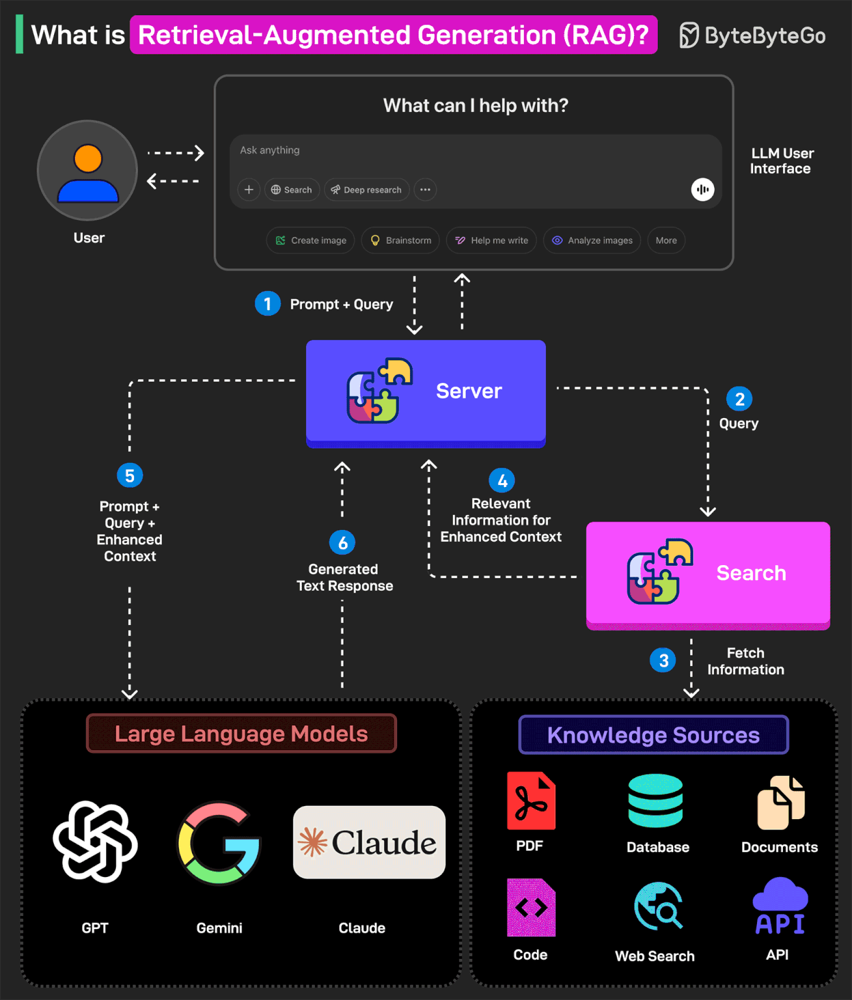

**Study-Buddy** is an innovative, voice-enabled artificial intelligence tutor developed for the Azure AI Developer Hackathon that fundamentally transforms the interaction of students aged 15 to 25 years with their study content. The product utilizes **the rapid coding capability of GitHub Copilot and the extensive set of features of Microsoft Azure** - such as speech services, real-time translation, document intelligence, and open-source data analytics - to deliver an immersive, multi-dimensioned learning experience. Through the application of humor, response-based interactivity, and personalized insights, **Study-Buddy transforms boring study sessions into engaging experiences, assisting in building a genuine passion for learning**. Through interactive study group sessions to mood-based personal guidance, **this AI-powered study buddy ensures that all students experience a sense of companionship, motivation, and active participation in the educational process**.

---

### **Features and Functionality**

1. **Conversational AI Interaction**
   - **Multi-Modal Communication:** Provides support for text-to-text, speech-to-speech, text-to-speech, and speech-to-text interactions so the user can communicate in his or her most preferred mode using **Azure Cognitive Speech Services**.
   - **Dynamic Responses:** Sends related GIFs, using **GIPHY** API, with messages to make the interactions lively and engaging.
   - **Expert Personas:** Adopts the persona of an expert in a user-selected topic (e.g., Science) to deliver responses that are both informative and engaging.
   - **Multi-Language Support:** Allows communication in more than one language, making it more accessible to different users using **Azure Translator service**.
   - **Initial Greeting and File Uploads:** Starts the interactions with a friendly greeting and lets users upload files for further assistance.
   - **Web and Place Searches:** Uses **Tavily** and **Bing** APIs to perform thorough web searches and **Google Places** API for location-based queries.
   - **Resource Access:** Searches and returns links for open-source textbooks in **Project Gutenberg** and **public domain libraries**, and job listings through **Adzuna API**.
   - **Document Generation:** Generates documents in different formats like PDF, DOC, etc., depending upon the user's input.
   - **Mood Detection and Coping Mechanisms:** Analyzes user mood using **Azure Text Analytics** and provides relevant coping strategies.
   - **User Profile and User Journey Integration:** Reads and uses **user profiles and user journey** from **Cosmos MongoDB** to make interactions more personalized.

2. **AI Avatar Interaction**
   - **Azure Cognitive Speech Services:**  Powers the voice capabilities of the AI avatar, enabling natural and responsive conversations.
   - **Animated Avatar:** Includes a moving avatar that increases user engagement and provides a visual representation of the AI mentor.
   - **Comprehensive Functionalities:**  It emulates capabilities inherent in Conversational AI Interaction, including file upload, web searches, document creation, and mood detection.

3. **AI Quiz Generator**
   - **Customizable Quizzes:** Allows users to specify the number of questions, topics, sub-topics, and difficulty levels (easy, medium, hard).
   - **File-Based Quiz Generation:** Generates quizzes based on uploaded study materials using **Azure Documentation intelligence service**.
   - **Instant Feedback:** It gives instant feedback to responses by awarding points for correct answers and deducting points for wrong ones.
   - **Azure OpenAI Integration:** Leverage **Azure OpenAI Services** to efficiently create and validate quiz content.
 - **leaderboard:** It is helpful to users by providing motivation and engagement through a sense of competition and achievement. They also allow users to track their progress, compare it with others, and receive immediate feedback on their performance.
 - **Performance-chart:** This helps users to understand their performance across different subject areas. 

4. **Content Translation**
   - **Azure Translator Service:** Translates all content to the user-preferred language, making it accessible to users who do not understand English.
   - **Seamless Integration:** Applies translation services to all backend processes and frontend displays for uniformity in the user experience.

5. **Collaborative study groups** and peer discussion forums.
   - The **Study-Buddy platform** offers comprehensive collaborative study groups and peer discussion forums.
   - Users can **create, join, and manage study groups** with features like:
       - Real-time chat
       - Group posts
       - Threaded discussions
    - The platform is backed by a robust **Flask-Python backend** and an interactive **Angular.js frontend**.
    - Ensures a dynamic and engaging learning environment.
    - Additional functionalities include:
      - Member management
      - Privacy settings
      - Multimedia sharing
    - Ideal for students seeking a productive and interactive way to enhance their learning experience.

6. **Career guidance features** 
   - **Resume Building:**
     - Users can **create and manage their resumes** using the resume builder feature. 
     - The system allows users to input their **personal information, education, work experience, projects, skills, and references**.
     - Resumes can be enhanced with AI suggestions to **improve their ATS (Applicant Tracking System) scores**, ensuring better chances of getting noticed by recruiters.
     - Users can also generate well-structured **resumes in various formats**, ready to be shared with potential employers.
     - The resume builder provides a **user-friendly interface** with real-time preview, making it easy to see how changes will affect the final document.
     - Users can **save multiple versions of their resume**, allowing them to tailor their applications for different job opportunities.
     - The platform also **includes templates and formatting** options to help users create professional and visually appealing resumes.
     - With secure storage and easy access, users can **update and download their resumes anytime**, ensuring they are always ready for new job applications.

7. **User Authentication**
 - **Secure Login/Signup:** Offers both manual entering of credentials and Google Authenticator for secure and hassle-free authentication for users.
 - **Forgot Password Option:** Provides the secure and user-friendly feature of resetting passwords with verification, through an email that guarantees both account security and accessibility.

---

### **Technological Implementation**

**Study-Buddy** represents good software development since it incorporates both **GitHub Copilot** and **Microsoft Azure** tools in its implementation to provide a wholesome experience. **GitHub Copilot** really fast-tracked our development; it not only enabled the very fast generation of code but also assured the quality and efficiency of the codebase. The project utilizes different services from Azure, which include:


- **Azure Cognitive Speech Services:** Built for natural language processing and voice interaction.
- **Azure Text Analytics:** To identify the user's mood and recommend appropriate coping mechanisms.
- **Azure Translator Service:** To provide multilingual support.
- **Azure OpenAI Services:** To generate and score the content for conversation and quizzes.
- **Azure Document Intelligence:**For uploaded document processing.
- **Azure Cosmos DB for MongoDB(vCore):** Stores user data and provides data management.
- **Azure Container Registry:** Stores and manages Docker images of our backend services in an efficient way for version control and distribution.
- **Azure Container Apps:** This was used to deploy and scale our microservices architecture easily.
- **Azure Web App:** To host and deploy the frontend of Study-Buddy.
- **Azure Bing Search:** To take a user's query and perform a web search, responding with articles, news, and other relevant information.
- **Azure Blob Storage:** Used for storing user profile pictures and other uploaded files securely.


The **Flask-Python** backend of this application makes it both scalable and reliable. It has also utilized **Angular.js** in the development of a responsive, interactive frontend; furthermore, multiple APIs, like **Tavily, GIPHY, Google Places,** and **Adzuna**, have been integrated into making the application richer in features, thus capable of handling more extensively.

The codebase is well-documented, following best practices and complemented by the smart code completions of **GitHub Copilot**. This thorough approach ensures that the code remains maintainable and promotes a high degree of collaboration between team members, which raises quality throughout the software development process.


---

### **Design**

**Study-Buddy** has a user-centric design that **balances frontend aesthetics with backend robustness**. Its UI is clean, intuitive, and visually appealing to young learners. Key design considerations include:

- **Responsive UI:** The platform is designed to work on a variety of devices, ensuring users experience an equally seamless experience on mobile devices, tablets, or desktops.
  
- **Interactive Elements:** Interactive features such as animated avatars, GIF integrations, and real-time chat make learning more fun and delightful for users.

- **Accessibility:** Multi-language support and simple navigation enhance accessibility for users from diverse backgrounds.

- **Balanced Architecture:** A well-structured blend of frontend and backend components ensures smooth functionality and scalability. The frontend, built with Angular.js, handles user interactions and displays, while the backend, powered by Flask-Python, manages data processing, AI functionalities, and integrations with external APIs.

- **Component-based Frontend:** The frontend architecture follows a component-based approach, ensuring reusability and modularity of UI elements, which facilitates easier maintenance and scalability.

- **Robust Backend Services:** The backend includes robust services for handling group management, real-time communication, and secure data storage using MongoDB and Azure services.

- **AI Integration:** AI-driven features, such as personalized study recommendations and resume enhancement, are seamlessly integrated to provide users with advanced functionalities.

- **Security and Privacy:** Strong emphasis is placed on user data security and privacy, with secure authentication mechanisms and encrypted data storage.

- **Collaboration Tools:** Features like group posts, threaded discussions, and peer forums foster a collaborative learning environment.

This comprehensive design ensures that Study-Buddy is not only visually appealing but also functionally robust, scalable, and accessible to a wide range of users.

---

### **Potential Impact**

Study-Buddy can transform education today by putting a highly interactive, AI-driven assistant at the focal point of learning. It does not merely represent the current group of students and holds many benefits:

- **Enhanced Learning**: By coupling fun, AI-driven quizzes, and instant feedback, Study-Buddy motivates students to learn more and remember more - leading to better school performance and a lifelong love of learning.
- **Global Accessibility**: Study-Buddy integrates support for multiple languages with Azure Translator and accessibility-focused features. It helps diverse communities all over the world break language barriers. This allows anyone to access and gain from an inclusive learning experience.
- **Scalability and Adaptability**: Modular design enabled by Azure Container Apps and Azure Cosmos DB makes it easy to scale. Study-Buddy can just as easily adapt to various learning environments as educational needs evolve, from individual users to entire schools.
- **Developer Community Inspiration**: Study-Buddy is an exemplary demonstration of how GitHub Copilot and the Microsoft Azure platform can be leveraged to rapidly prototype, iterate, and deploy effective AI solutions. Not only does it raise the bar in EdTech, but also paves the way for other developers looking to develop groundbreaking cloud-based applications.

---

### **Quality of the Idea**

Study-Buddy is a novel and groundbreaking learning technology solution. It combines chat-based AI, advanced data analysis, and interactive engagement into one easy-to-use platform.

- **Humor and Engagement**: Utilizing animated GIFs and AI-created avatars gets students excited and involved. It converts learning into enjoyable exploration from boring tasks.
- **Expert Personas**: Assuming the expert personas, Study-Buddy encourages more curiosity and empathy-inspired learning. Students feel like they are being counseled by known figures, something that can significantly boost scholarly inspiration.
- **Comprehensive Feature Set**: Ranging from the generation of quizzes that adapt to an uploaded user resource to recognizing emotional states and recommending coping strategies, Study-Buddy encompasses all the significant areas of learning - ensuring a holistic solution that traditional solutions fail to provide.
 - **Sophisticated AI Integration**: Riding on GitHub Copilot's coding smarts and supported by Microsoft Azure's range of AI services, the platform provides strong, state-of-the-art capabilities. This firm tech backbone not only maximizes reliability but also guarantees ongoing innovation.
 - **Personalization**: Through automated mood detection, user-specific recommendations, and a personalized learning pathway, every student has education personalized to their requirement. This method enhances student involvement and improves their performance in school.

**Study-Buddy** puts modern EdTech concepts into action and gives them a creative twist, including alternative means of communication and instant resource searching. This enhances online learning considerably and makes it more enjoyable than ever.

---


### **Contributing to Study-Buddy**

We welcome contributions to Study-Buddy! Here’s a quick guide to help you get started:

#### **How to Contribute**

1. **Fork the Repository:**
   - Click the "Fork" button at the top right corner of this repository to create a copy under your GitHub account.

2. **Clone Your Fork:**
   - Clone your fork to your local machine using:
     ```bash
     git clone https://github.com/Georgia-Southwestern-State-Univeristy/capstone-project-study-buddy.git
     ```

3. **Create a Branch:**
   - Create a new branch for your feature or bugfix:
     ```bash
     git checkout -b feature-or-bugfix-name
     ```

4. **Make Changes:**
   - Implement your changes in the codebase. Ensure to follow the project's coding style and guidelines.

5. **Commit Your Changes:**
   - Commit your changes with a meaningful commit message:
     ```bash
     git add .
     git commit -m "Description of your changes"
     ```

6. **Push to Your Fork:**
   - Push your changes to your forked repository:
     ```bash
     git push origin feature-or-bugfix-name
     ```

7. **Create a Pull Request:**
   - Go to the original repository and click on "Compare & pull request".
   - Provide a clear description of your changes and why they are necessary.

#### **Workflow**

1. **Open an Issue:**
   - If your contribution is significant (e.g., adding a new feature), open an issue first to discuss your proposal.

2. **Code Review:**
   - Your pull request will be reviewed by the maintainers. Be prepared to make changes based on feedback.

3. **Merge:**
   - Once approved, your pull request will be merged into the main branch.

#### **Code of Conduct**

- Be respectful and considerate of others.
- Provide constructive feedback.
- Follow the guidelines for code contributions.

---
### **Conclusion**

**Study-Buddy** integrates **GitHub Copilot's rapid development capabilities with a broad set of Microsoft Azure services.** This demonstrates how it might transform education delivery, receipt, and comprehension. By emphasizing user engagement, personalization, and inclusivity, **this AI-based tutor extends beyond conventional study aids.** With a robust microservices architecture, real-time collaboration capabilities, and a compassionate attitude towards user requirements, **Study-Buddy is set to be a global phenomenon in the EdTech space.**

**Join us in revolutionizing education with AI-powered solutions!**

---
Thank you for contributing to Study-Buddy!
